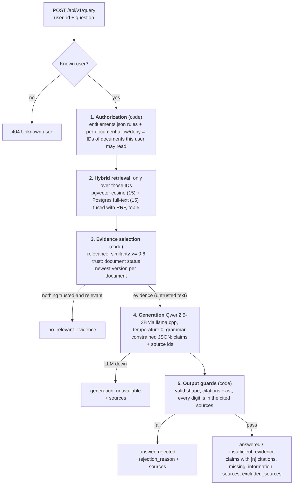
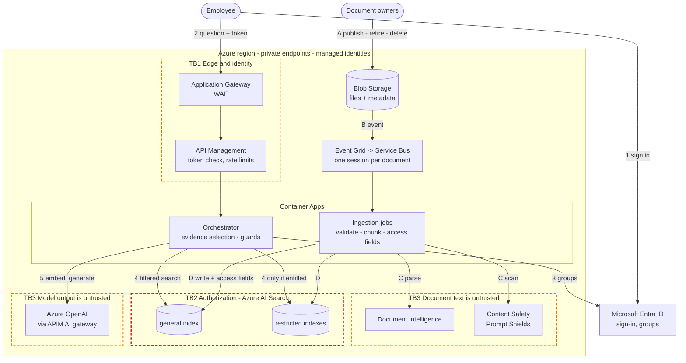

# How to run:

- install docker desktop or an alternative first
- pull the repo locally, in the root dir, do the following commands:
- `docker compose up -d`
- `docker compose exec api poetry run alembic upgrade head`
- `docker compose exec api poetry run python -m scripts.seed_data`
- open [localhost:8000](http://localhost:8000/) in any web browser
- use the [POST /api/v1/query](http://localhost:8000/docs#/Enterprise%20Knowledge%20QA/query_endpoint_api_v1_query_post) endpoint to query the sample data provided in any of the made-up cases.

# Part 1 - Local RAG:

## How a question becomes an answer:

Every response lists the `sources` used (document ID, version, status, etc.) and the `excluded_sources` that were relevant but deliberately not used, with the reason (`retired`, `unverified`, `superseded`, `unrecognized_status`).

## Trust boundaries

1. **Authorization before retrieval:** `AuthorizationService` computes the user's allowed document IDs, and searches filter on them in SQL. Everything afterwards (scores, ranking, evidence selection, etc.) is computed only from documents the user has permission to read. i.e. a restricted document can't appear in an answer, nor can it influence it at all.
2. **LLM doesn't decide anything:** Access, trust and evidence are decided by deterministic code before the LLM is called. Document text and model output are both treated as untrusted. The LLM sees only selected, trusted evidence, has no tools, can only output the specified JSON structure, and its output is checked by code before being returned.

## Decisions

**Access**

- Authorization before retrieval, as a SQL filter on allowed document IDs.
- The rules are ANDed and fail closed. A deny override always wins. A document allow list must match. The classification rule must match. Additionally, a classification with no rule gets `default_rule` from `entitlements.json`, and if no rule is no `default_rule` is specified, the rule defaults to a denial.
- A missing `entitlements.json` stops the API from starting.
- Authorization verdicts carry no document ID, so a deny can't reveal that a restricted document exists, even if a verdict were logged. So no one can deduce the existence or absence of any other documents hidden from them.
- The seed deletes and re-inserts everything from the supplied files, so a group, user or override removed from a file stops granting access on re-seeds. This is to simplify the local implementation.

**Evidence quality**

- **Relevance gate**: Evidence must have cosine similarity >= 0.6. This was calibrated on the sample corpus. The best on-topic match scored >= 0.66, while the best off-topic match <= 0.50. Keyword only matches can't pass.
- **Trust from `status`,** the only trust signal in the metadata:
  - authoritative: `Current`, `Active`, `Open`;
  - advisory: `Active advisory`, the Legal memo;
  - excluded: `Retired`, `Unverified` and any unknown status (fail closed).
- **Supersession**: Only the newest version of each document is used. Older versions are listed as `superseded`.
- **Advisory sources**: Are ordered after authoritative ones, and are tagged `authority="advisory"` in the prompt. Prompt rules specify that advisory statuses qualify a policy but never override it.
- **Excluded documents never reach the LLM**: The KB-991 article, which contains the injected instructions, is never in any prompt.

**Traceability and unsupported claims**

- **Grammar-constrained output**: The answer is a list of claims, each with at least one source id. Source ids can only be sources that were actually in the prompt. An uncited claim or an invented source can't be generated.
- **Digit check**: Every digit in a claim must appear in the sources that claim cites, and every digit in `missing_information` must appear in the evidence. This targets the invented-SLA incident: "respond within 6 hours" citing a contract with no 6 is rejected. Numbers typed in the question don't count as support.
- **Refusals say what's missing**: `answerable: false` with a one-sentence `missing_information`, gives `insufficient_evidence`, not a guess.

## Alternatives considered

- **Authorization as one SQL query (inside retrieval)**: Authorization bugs are critical. ~50 lines of plain Python are easy to review and unit-test without a database. Local scale isn't assessed. The SQL version would mean keeping two copies of the policy in sync.
- **Status mapped in a config file**: The status mapping needs to not be in the code in any real product. But due to time limitations, I've made it in the code.
- **A bigger model, like Qwen2.5-7B**: This would improve the quality in this task. For production, the estimates would need be compared to the quality, latency, etc. to pick the best model possible. For this task, I settled on a very small model.

## Assumptions/Limitations:

- Authorization rules are ANDed. Every point is checked in this order. If any step fails, the auth rejects the request:
  1. The user is not in any of the document's deny groups.
  2. If the document has an allow list, the user is in it. (No allow list: check skipped.)
  3. If the document's classification has a rule, the user is in one of its allowed groups.
  4. If the classification has no rule, "default_rule" is checked. "default_rule" only stands in for a missing classification rule, and an allow override can narrow access but never grant what the classification rule denies. If there is no "default_rule" mentioned I assume it's a deny to enhance security.

  The assumption here is on the "default_rule". I could instead make it so "default_rule": "allow" means always allow unless there's an explicit denial mentioned, and "deny" means always deny unless there's an explicit allowance. Currently instead, "default_rule" only applies if the classification rule is missing.

- Some hardcoding have been tailored to the small sizes of documents. This includes the relevance threshold.
- No reranker was used. I've used a relevance threshold to save time. A real system should use a reranker.
- Some Pydantic schemas were skipped due to time limitations, and raw JSON were used instead.
- Rag pipeline, ingesting, etc. isn't really exposed for real user use in this project. Even though the backend is there, it's mostly utilized by the scripts alone, due to time limitations.
- ### Model Decision:
  - I've opted to use Qwen2.5-3B-Instruct and BAAI/bge-small-en-v1.5 for embeddings. The models used are very small. Results will not be good for anything production level, but it's useful here to demonstrate the guardrails against LLM hallucinations. A bigger model would increase the quality, but this should run on any hardware without wasting time generating tokens.
  - I've used answer generation as opposed to returning passages, to answer user questions in the same manner of asking, instead of returning passages that do answer the question, but written differently, which would act more like a search engine for documents that returns relevant sections as is. The "evidence-backed answer" business requirement also alludes to the fact that there should be answer alongside the evidence, not just the evidence. Additionally, if the LLM decides that the sources do not contain the answer for the questions, all source chunks above the vector similarity threshold are returned to the employee (after filtering by statuses and newest version). Even though in this project, every sample document is one chunk.
- Advisory never overrides rule is enforced by the prompt only. No current code checks what an advisory claim means.
- Citation accuracy isn't verified for non-numeric claims. The code only requires the info is cited somewhere.

# Part 2 - Azure Design:

## 1. Architecture

**Employee request (1-5)**

1. The employee signs in with Entra ID and receives a token.
2. The question goes through Application Gateway (WAF) and API Management, which validates the token and applies a per-user rate limit.
3. The orchestrator takes the user's identity from the token only, then looks up the user's groups in Entra ID through Microsoft Graph.
4. It always searches the general index, and searches a restricted index only if the user is entitled to that classification. Each query is hybrid (keyword + vector) with the semantic ranker, and carries the user's security filter.
5. Code selects the evidence (relevance, status, newest version). Azure OpenAI writes claims with citations, and the prototype's guards check them before the answer is returned.

**Content change (A-D)**

- **A.** An owner publishes, updates, retires or deletes a document. The file and a metadata file (version, status, classification, permissions) land in Blob Storage.
- **B.** Event Grid puts a message on Service Bus. Each document has its own session, so its changes are applied in order.
- **C.** An ingestion job validates the metadata. It parses the file with Document Intelligence and scans it with Prompt Shields. An unknown status or a flagged document is quarantined, without being indexed.
- **D.** The job chunks the text, computes the access fields and embeds the chunks. It writes the new version to the matching index, then marks the old version superseded. Retirements, deletions and permission changes skip step C and only update fields.

**Trust boundaries**

- **TB1 Edge and identity:** a request is untrusted until API Management and the orchestrator validate its token. The user is the token's object ID, not a field in the request (unlike the prototype's `user_id`).
- **TB2 Authorization (the most important one):** access is enforced inside Azure AI Search, before scoring. Unauthorized content never enters the request.
- **TB3 Untrusted content:** document text and model output are data, and not instructions. Documents are scanned at ingestion, the model has no tools, and code checks the model's output.

## 2. Component map

### How knowledge is stored and changed

| Azure service                                     | Responsibility                                                                                                                    | Why                                                                                    | Alternative / trade-off                                                                                                                   |
| ------------------------------------------------- | --------------------------------------------------------------------------------------------------------------------------------- | -------------------------------------------------------------------------------------- | ----------------------------------------------------------------------------------------------------------------------------------------- |
| Blob Storage (ZRS, versioning)                    | Raw documents with their metadata files, plus parsed chunks and vectors                                                           | Cheap for 180 GB, emits change events, and the index can be rebuilt without re-parsing | AI Search's SharePoint indexer (preview): less plumbing, but skips the metadata and access checks                                         |
| Event Grid + Service Bus Premium                  | An ordered, retryable queue of changes, with a dead-letter queue                                                                  | Sessions keep each document's changes in order                                         | Storage queues: cheaper, but no ordering                                                                                                  |
| Container Apps jobs                               | Ingestion: validate, parse, scan, chunk, compute access fields, embed, write                                                      | The same Python code and container as the prototype's seed script; scales to zero      | Azure Functions (Flex Consumption): simpler triggers, but it can't run containers, so ingestion would be packaged separately from the API |
| Document Intelligence (Layout)                    | Text as Markdown from PDF and DOCX, tables keep their rows, columns and merged cells (written as HTML tables inside the Markdown) | Keeps table structure, the prototype's known weak spot                                 | Plain text extraction: cheaper, but loses tables                                                                                          |
| Content Safety Prompt Shields                     | Detects instructions hidden in documents, which are then quarantined                                                              | Runs once per change, not on every request                                             | Scanning at query time: adds latency to every request                                                                                     |
| Azure AI Search (S1, 3 replicas, semantic ranker) | Hybrid search, reranking and access filtering, over one general index plus one index per restricted classification                | Keyword, vector, reranker and filters in one service; filters apply before scoring     | PostgreSQL + pgvector (the prototype's store): no managed reranker, and we would tune it at ~700k chunks ourselves                        |

### How employee questions are answered

| Azure service                                                                             | Responsibility                                                                                                                   | Why                                                                                                                                                                                                                                                                                                                            | Alternative / trade-off                                                                                                                                                                                                               |
| ----------------------------------------------------------------------------------------- | -------------------------------------------------------------------------------------------------------------------------------- | ------------------------------------------------------------------------------------------------------------------------------------------------------------------------------------------------------------------------------------------------------------------------------------------------------------------------------ | ------------------------------------------------------------------------------------------------------------------------------------------------------------------------------------------------------------------------------------- |
| Application Gateway WAF v2                                                                | Single entry point, TLS, WAF                                                                                                     | Regional, so traffic stays in the region                                                                                                                                                                                                                                                                                       | Front Door: a global edge, outside the region                                                                                                                                                                                         |
| API Management                                                                            | Token validation and rate limits. Also the AI gateway to Azure OpenAI: token quotas, token metrics, failover between deployments | Policies instead of code, and one metering point                                                                                                                                                                                                                                                                               | Validating in the orchestrator only: cheaper, but metering and failover become our code                                                                                                                                               |
| Container Apps (orchestrator)                                                             | Runs the prototype's pipeline: identity, search, evidence selection, generation, guards                                          | The prototype is already a FastAPI container, and revisions give canary releases and instant rollback                                                                                                                                                                                                                          | AKS: more control, but much more operations work                                                                                                                                                                                      |
| Azure OpenAI in Microsoft Foundry (formerly Azure AI Foundry), "Standard" deployment type | Embeddings (`text-embedding-3-large`), and a small chat model with structured outputs and no tools                               | Structured outputs replace the llama.cpp grammar. They don't support `minItems`/`maxItems`, so "at least one citation" and the claim limit are enforced in code (the guards already reject uncited claims). A larger model than the 3B should fix table reading. The Standard type keeps processing in the region's geography. | An open-weight model on Azure Machine Learning endpoints: we control the weights, but we run the GPU serving                                                                                                                          |
| Code in the orchestrator                                                                  | Evidence selection and guards (the prototype's `EvidenceSelector` and `verify_answer`)                                           | Deterministic and unit-tested                                                                                                                                                                                                                                                                                                  | Foundry Agent Service with Foundry IQ (the replacement for "On Your Data", which retires in October 2026): less code, but the trust rules run inside a managed pipeline we can't unit-test, and it doesn't support structured outputs |

### How access is enforced

| Azure service                                                              | Responsibility                                                                                                                                                                      | Why                                                                                                         | Alternative / trade-off                                                                                                                                               |
| -------------------------------------------------------------------------- | ----------------------------------------------------------------------------------------------------------------------------------------------------------------------------------- | ----------------------------------------------------------------------------------------------------------- | --------------------------------------------------------------------------------------------------------------------------------------------------------------------- |
| Microsoft Entra ID + Graph                                                 | Sign-in with Conditional Access; the user's groups are looked up per request and cached for up to 5 minutes                                                                         | Identity comes from the token, and a removed membership takes effect within 5 minutes                       | The groups claim in the token: no lookup, but stale until the token expires (60-90 min)                                                                               |
| AI Search security filter (mirroring prototype rules) + restricted indexes | The prototype's `AuthorizationPolicy` computes each chunk's access fields at ingestion. Every query carries the filter, and restricted indexes are queried only for entitled users. | The policy runs once per document change, not per document on every request (the prototype's scaling limit) | AI Search's built-in Entra access control (preview): grants access when any user or group entry matches, so it can't express deny overrides or "must pass both rules" |
| Private endpoints, managed identities, Key Vault, Azure Policy             | No public data plane and no keys. Policy enforces the region and regional-only model deployments.                                                                                   | Prevents leaks through misconfiguration                                                                     | IP firewall rules: cheaper, but weaker                                                                                                                                |

### How the platform is operated and released

| Azure service                                                      | Responsibility                                                                    | Why                                                                      | Alternative / trade-off                            |
| ------------------------------------------------------------------ | --------------------------------------------------------------------------------- | ------------------------------------------------------------------------ | -------------------------------------------------- |
| Azure Monitor (Application Insights, Log Analytics)                | Metadata-only telemetry: status, latency per stage, tokens, configuration version | In the region, with KQL alerts                                           | Azure Managed Grafana for dashboards               |
| Microsoft Foundry evaluation + the prototype's `run_evaluation.py` | Release gate: the prototype's cases plus groundedness scores                      | Keeps the prototype's checks and adds scoring for claims without numbers | The prototype harness alone: can't score grounding |
| Azure Load Testing (part of Azure App Testing)                     | p95 check at 2x peak before a release                                             | Catches latency and cost regressions before users do                     | Manual load runs                                   |
| Azure DevOps Pipelines + Container Registry + Bicep                | Build, test, gate, and deploy revisions and infrastructure                        | Azure-native, with no stored secrets                                     | GitHub Actions: equivalent                         |
| Cost Management + APIM token metrics                               | Budgets, anomaly alerts, tokens per department and per version                    | Shows which change moved the cost                                        | A monthly invoice review: finds problems late      |

## 3. Keeping restricted information out

- A restricted index is never queried for a user who isn't entitled to it, so it can't affect results, ranking, timing or refusal wording.
- Every query carries the security filter, applied before scoring.
- The prompt and the response use only filtered evidence:
  - no answer cache is shared between users;
  - the refusal text is the same whether or not restricted documents exist;
  - excluded sources only list documents the user may read.
- Telemetry is an allow-list of metadata: no question, evidence or answer text. Users are pseudonymized, and API Management body logging is off.
- Queue messages and ingestion logs hold IDs and hashes only, and restricted document IDs appear only as opaque keys.
- **Verified, not just designed:**
  - CI tests check that the filter allows exactly what `AuthorizationPolicy` allows, for every test user and document.
  - In production, each restricted index holds a synthetic document with a random marker, and unauthorized test users ask about it every few minutes. The marker in any response or in the logs is a Sev 1.

## 4. Meeting the production assumptions

| When...                                      | Design                                                                                                                                                                                                                                                                                                                                                                                                                                                                                                                  |
| -------------------------------------------- | ----------------------------------------------------------------------------------------------------------------------------------------------------------------------------------------------------------------------------------------------------------------------------------------------------------------------------------------------------------------------------------------------------------------------------------------------------------------------------------------------------------------------- |
| **Content changes** (~200 a day)             | Each change is an event. Retirements, deletions and permission changes only update fields, so they apply within ~5 min. New versions (parsing and embedding) take ~30 min. A new version is indexed before the old one is marked superseded, so a query never sees a gap. A nightly job compares Blob Storage with the index to catch missed events.                                                                                                                                                                    |
| **Work is retried**                          | Ingestion is at-least-once and idempotent: deterministic chunk keys, upserts, and content-hash skips. After 5 attempts a message is dead-lettered and alerted. If the failed change was a restriction (retire, delete, narrower access), the document is removed from the index: fail closed. On the query path, Search gets one retry; a guard rejection is not retried.                                                                                                                                               |
| **Dependencies fail**                        | Search down: no answer, never an ungrounded or unfiltered one. Azure OpenAI down: authorized sources only (the prototype's `generation_unavailable`). Entra ID down: the request is refused. Parsing or scanning down: the previous version keeps serving, and nothing is indexed unscanned. Zone outage: all services are zone-redundant.                                                                                                                                                                              |
| **Usage grows** (5,000 users, 20 requests/s) | Container Apps autoscale on concurrency (minimum 3 replicas). Search adds replicas for load and partitions for size. ~700k chunks (estimate) fit one S1 partition (35 GB of vector quota). Replicas are also sized for the semantic ranker, which allows 3 concurrent requests per search unit on S1; the load test confirms this. Azure OpenAI starts pay-per-token, because the peak is far above the average, and moves to provisioned throughput (PTU) once load is measured. API Management quotas per department. |
| **Quality, latency or cost regress**         | Every request is stamped with the configuration version (prompt, model, index, thresholds). The release gate blocks on the prototype's cases (3 runs each), the ACL tests, groundedness scores, load-test p95, and tokens per request. Releases go to 5% of traffic first and roll back automatically. In production, alerts fire on the answer/refusal/rejection mix, p95 per stage, and tokens per request and budgets.                                                                                               |

**p95 below 6 s.** Budget: ~0.3 s for gateway, identity and embedding; ~0.7 s for search with the semantic ranker; ~3.5 s for generation (<= ~4k tokens in, <= 400 out). That's ~4.5 s in total, to be confirmed by the load test.

## 5. Migration path and priorities

| Prototype                                                         | Azure                                                                                                                                                                               |
| ----------------------------------------------------------------- | ----------------------------------------------------------------------------------------------------------------------------------------------------------------------------------- |
| `user_id` in the request, `identities.json`                       | Entra ID token and groups                                                                                                                                                           |
| `AuthorizationService` loops over every document on every request | Access fields computed at ingestion, plus the search filter. `AuthorizationPolicy` is reused.                                                                                       |
| PostgreSQL + pgvector, RRF in Python                              | Azure AI Search hybrid search + semantic ranker                                                                                                                                     |
| One chunk per document; cosine ≥ 0.6 gate                         | Chunking by section and table; relevance gate on the reranker score, recalibrated                                                                                                   |
| Qwen2.5-3B on llama.cpp                                           | Azure OpenAI with structured outputs, behind the same `LLMClient` interface. `answer_schema` drops `minItems`/`maxItems` (not supported), and a claim-count check joins the guards. |
| `seed_data.py`                                                    | Event-driven ingestion                                                                                                                                                              |
| `run_evaluation.py`                                               | CI release gate                                                                                                                                                                     |

Kept: `EvidenceSelector`, `verify_answer` (plus the claim-count check), the prompt rules and `cases.jsonl`.

**Steps**

1. **Foundations:** choose a region that offers the needed models and services; set up network, policies, the Entra app and the pipeline.
2. **Parity:** port the adapters, then pass the test cases on Azure with the assessment pack.
3. **Pilot:** one real document source, ~200 users, monitoring and canaries.
4. **Scale:** load all 60,000 documents, load test at 2x peak, then roll out department by department.

**First two investments prioritized:**

1. **Permission- and status-aware ingestion into the filtered indexes,** with the ACL tests and canaries. Incidents 1 and 3 are both about what the index holds and who can see it. It is the only zero-tolerance requirement, and the hardest part to retrofit once 60,000 documents are indexed.
2. **The release gate and production monitoring.** Incident 4 is a regression found after release. Every later change (a bigger model, relevance tuning) needs this gate, and the capacity and cost decisions need its measurements.

# AI Disclosure

- Data seeding and evaluation scripts were created completely by AI.
- Some boilerplate code like the Settings class, DB connections, Docker files, etc., were created by AI then minorly tweaked.
- Other tweaks like running the LLM on all threads given to docker/wsl, were AI assisted.
- Unit tests were made by AI.
- Test cases were generated by AI, alongside the [load_query_examples function](src/routes.py#L19-L36).
- Retrieval functions were mostly coded by AI, due to the time limitations.
- Calibration for minimum evidence similarity was tested by AI.
- Some documentation were generated by AI.
- Drafted the project structure using some AI help.
- Writing prompts were AI assisted.
- Clarified with AI some business logic, like what some statuses mean (e.g. Active advisory).
- Some up to date info gathering on Azure was AI assisted.
- mermaid flowcharts, some formatting in the markdown files were AI assisted.
